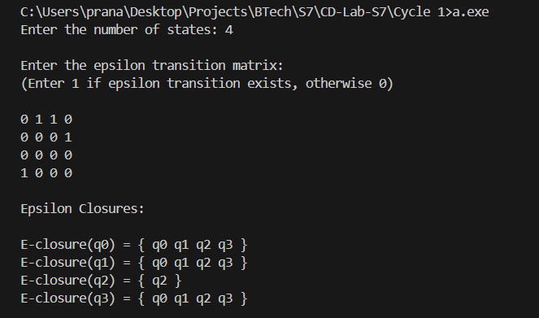

# Compiler Lab Experiment 1

Aim: To write a C program to find the ε — closure of all states of any given NFA with ε transition.

## Algorithm

1. Start.
2. Read the number of states `n`.
3. Read the ε-transition matrix of size `n × n`.
4. For each state `qi` from `q0` to `q(n-1)`, initialize the `closure` array to `0`.
5. Select state `qi` as the starting state.
6. Add the selected state to its ε-closure by marking `closure[i] = 1`.
7. Check all states `qj` from `q0` to `q(n-1)`.
8. If `matrix[i][j] == 1`, an ε-transition exists from `qi` to `qj`.
9. Check whether `qj` is already included in the closure.
10. If `qj` is not included, mark `closure[j] = 1`.
11. Recursively find the ε-closure of `qj`.
12. Repeat Steps 7–11 until all reachable states through ε-transitions have been visited.
13. Display all states whose corresponding `closure` value is `1`.
14. This gives the ε-closure of the selected state.
15. Reset the `closure` array for the next state.
16. Repeat Steps 5–15 for all `n` states.
17. Stop.

## Program

```c
#include <stdio.h>
#include <string.h>

char result[20][20], copy[3], states[20][20];

void add_state(char a[3], int i)
{
    strcpy(result[i], a);
}

void display(int n)
{
    int k = 0;

    printf("\nEpsilon closure of %s = { ", copy);

    while (k < n)
    {
        printf(" %s", result[k]);
        k++;
    }

    printf(" }\n");
}

int main()
{
    FILE *INPUT;
    INPUT = fopen("automata.txt", "r");

    char state[3];
    int end, i = 0, n, k = 0;
    char state1[3], input[3], state2[3];

    printf("\nEnter the no of states: ");
    scanf("%d", &n);

    printf("\nEnter the states (max 20)\n");

    for (k = 0; k < n; k++)
    {
        scanf("%s", states[k]);
    }

    for (k = 0; k < n; k++)
    {
        i = 0;

        strcpy(state, states[k]);
        strcpy(copy, state);

        add_state(state, i++);

        while (1)
        {
            end = fscanf(INPUT, "%s%s%s", state1, input, state2);

            if (end == EOF)
                break;

            if (strcmp(state, state1) == 0)
            {
                if (strcmp(input, "e") == 0)
                {
                    add_state(state2, i++);
                    strcpy(state, state2);
                }
            }
        }

        display(i);
        rewind(INPUT);
    }

    return 0;
}
```

## Output

