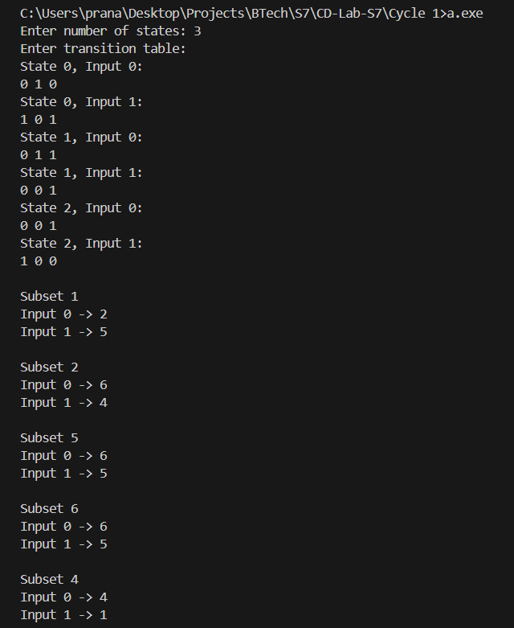

# Compiler Lab Experiment 3

Aim: Write a program to convert NFA to DFA.

## Algorithm

1. Start.
2. Define the maximum number of states as `MAX = 10`.
3. Declare the transition array `trans`, where `trans[i][j][k]` represents the transition from state `i` on input `j` to state `k`.
4. Read the number of states `n`.
5. Read the transition table for each state and for both inputs `0` and `1`.
6. Initialize the queue with subset `1`, which represents the initial subset containing state `0`.
7. Set `front = 0` and `rear = 1`.
8. Repeat while the queue is not empty:

   * Remove the subset from the front of the queue and store it in `current`.
   * If `current` has already been visited, skip it.
   * Otherwise, mark `current` as visited.
9. Display the current subset.
10. For each input symbol `j` (`0` and `1`), initialize `next = 0`.
11. Check each NFA state `i` to determine whether it is present in the current subset using the bit representation.
12. If state `i` is present in the current subset, check all possible destination states `k`.
13. If `trans[i][j][k] = 1`, add state `k` to the next subset by setting its corresponding bit in `next`.
14. Display the resulting subset `next` for the current input.
15. If the resulting subset has not been visited, add it to the queue.
16. Repeat Steps 8–15 until all reachable subsets have been processed.
17. Stop.

## Program

```c
#include <stdio.h>
#define MAX 10

int n, trans[MAX][2][MAX];
int visited[100], queue[100];
int front = 0, rear = 0;

int main()
{
    int i, j, k;
    printf("Enter number of states: ");
    scanf("%d", &n);

    printf("Enter transition table:\n");
    for (i = 0; i < n; i++)
    {
        for (j = 0; j < 2; j++)
        {
            printf("State %d, Input %d:\n", i, j);
            for (k = 0; k < n; k++)
            {
                scanf("%d", &trans[i][j][k]);
            }
        }
    }
    queue[rear++] = 1;
    while (front < rear)
    {
        int current = queue[front++];
        if (visited[current])
            continue;
        visited[current] = 1;

        printf("\nSubset %d\n", current);
        for (j = 0; j < 2; j++)
        {
            int next = 0;
            for (i = 0; i < n; i++)
            {
                if (current & (1 << i))
                {
                    for (k = 0; k < n; k++)
                    {
                        if (trans[i][j][k])
                            next |= (1 << k);
                    }
                }
            }
            printf("Input %d -> %d\n", j, next);
            if (!visited[next])
                queue[rear++] = next;
        }
    }
    return 0;
}
```

## Output

