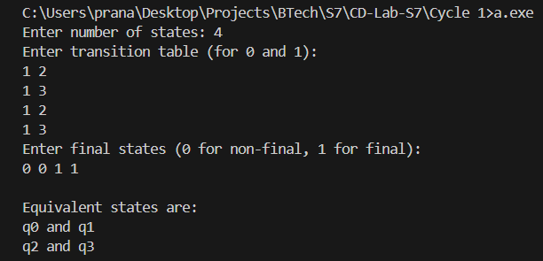

# Compiler Lab Experiment 4

Aim: Write a program to minimize any given DFA.

## Algorithm

1. Start.
2. Define the maximum number of states as `MAX = 20`.
3. Read the number of states `n`.
4. Read the transition table for each state for input symbols `0` and `1`.
5. Store the transitions in the `trans` array.
6. Read the final-state information for each state.
7. Store `1` for a final state and `0` for a non-final state in the `final` array.
8. Compare every pair of states `qi` and `qj`, where `i < j`.
9. Check whether both states have the same final/non-final status.
10. If `final[i] == final[j]`, compare their transitions for input `0`.
11. Check whether the destination states of input `0` are both final or both non-final.
12. Compare their transitions for input `1`.
13. Check whether the destination states of input `1` are both final or both non-final.
14. If all the conditions in Steps 9–13 are satisfied, declare `qi` and `qj` as equivalent states.
15. Display the equivalent pair of states.
16. Repeat Steps 8–15 for all pairs of states.
17. Stop.

## Program

```c
#include <stdio.h>
#define MAX 20
int main()
{
    int n, i, j;
    int trans[MAX][2], final[MAX];
    printf("Enter number of states: ");
    scanf("%d", &n);
    printf("Enter transition table (for 0 and 1):\n");
    for (i = 0; i < n; i++)
        scanf("%d %d", &trans[i][0], &trans[i][1]);
    printf("Enter final states (0 for non-final, 1 for final):\n");
    for (i = 0; i < n; i++)
        scanf("%d", &final[i]);
    printf("\nEquivalent states are:\n");
    for (i = 0; i < n; i++)
        for (j = i + 1; j < n; j++)
            if (final[i] == final[j] &&
                final[trans[i][0]] == final[trans[j][0]] &&
                final[trans[i][1]] == final[trans[j][1]])
                printf("q%d and q%d\n", i, j);
}
```

## Output

